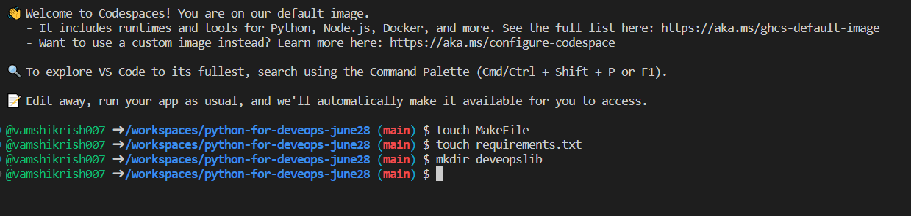

<h4>Will learn the step by step implementation of deveops using Python, Microservices, Aws and Git</h4>touch

<h4> Configure env:</h4>
<code>vamshikrish007 ➜ /workspaces/python-for-deveops-june28 (main) $ touch MakeFile
@vamshikrish007 ➜ /workspaces/python-for-deveops-june28 (main) $ touch requirements.txt
@vamshikrish007 ➜ /workspaces/python-for-deveops-june28 (main) $ mkdir deveopslib
@vamshikrish007 ➜ /workspaces/python-for-deveops-june28 (main) $ touch deveopslib/__init__.py
@vamshikrish007 ➜ /workspaces/python-for-deveops-june28 (main) $ touch hello.py
@vamshikrish007 ➜ /workspaces/python-for-deveops-june28 (main) $ virtualenv ~/.venv
created virtual environment CPython3.10.8.final.0-64 in 1397ms
  creator CPython3Posix(dest=/home/codespace/.venv, clear=False, no_vcs_ignore=False, global=False)
  seeder FromAppData(download=False, pip=bundle, setuptools=bundle, wheel=bundle, via=copy, app_data_dir=/home/codespace/.local/share/virtualenv)
    added seed packages: pip==23.1.2, setuptools==67.7.2, wheel==0.40.0
  activators BashActivator,CShellActivator,FishActivator,NushellActivator,PowerShellActivator,PythonActivator
@vamshikrish007 ➜ /workspaces/python-for-deveops-june28 (main) $ edit ~/.bashrc
</code>
 
Verify the conffigurations my selecting new terminal execute the following cms:

<code>(.venv) @vamshikrish007 ➜ /workspaces/python-for-deveops-june28 (main) $ which python
/home/codespace/.venv/bin/python
(.venv) @vamshikrish007 ➜ /workspaces/python-for-deveops-june28 (main) $ git status
On branch main
Your branch is up to date with 'origin/main'.
Changes not staged for commit:
  (use "git add <file>..." to update what will be committed)
  (use "git restore <file>..." to discard changes in working directory)
        modified:   README.md

Untracked files:
  (use "git add <file>..." to include in what will be committed)
        MakeFile
        deveopslib/
        hello.py
        image.png
        requirements.txt

no changes added to commit (use "git add" and/or "git commit -a")
(.venv) @vamshikrish007 ➜ /workspaces/python-for-deveops-june28 (main) $ git add *
(.venv) @vamshikrish007 ➜ /workspaces/python-for-deveops-june28 (main) $ git commit -m "adding structure"
[main 4287e36] adding structure
 6 files changed, 2 insertions(+), 1 deletion(-)
 create mode 100644 MakeFile
 create mode 100644 deveopslib/__init__.py
 create mode 100644 hello.py
 create mode 100644 image.png
 create mode 100644 requirements.txt
(.venv) @vamshikrish007 ➜ /workspaces/python-for-deveops-june28 (main) $ git push
Enumerating objects: 8, done.
Counting objects: 100% (8/8), done.
Delta compression using up to 2 threads
Compressing objects: 100% (4/4), done.
Writing objects: 100% (6/6), 45.87 KiB | 15.29 MiB/s, done.
Total 6 (delta 1), reused 0 (delta 0), pack-reused 0
remote: Resolving deltas: 100% (1/1), completed with 1 local object.
To https://github.com/vamshikrish007/python-for-deveops-june28
   a7db7ed..4287e36  main -> main
(.venv) @vamshikrish007 ➜ /workspaces/python-for-deveops-june28 (main) $</code>
